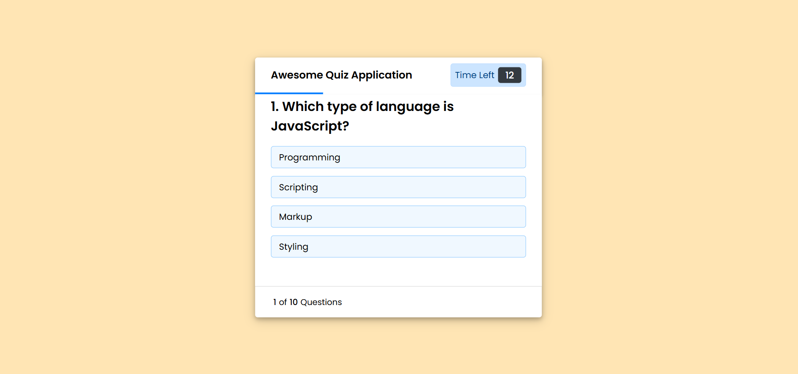
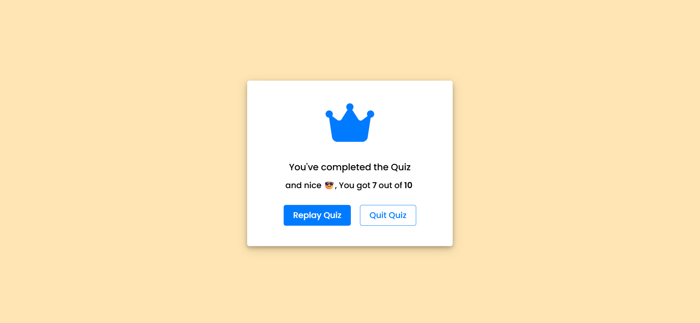

# 🧠 Quiz Web Application

An interactive **Quiz Web Application** built using **HTML, CSS, and JavaScript**.
This app allows users to answer multiple-choice questions within a time limit and displays the final score at the end.

---

## 🚀 Features

* 🎯 Multiple-choice quiz system
* ⏱️ **15-second timer** for each question
* 📊 Dynamic **progress bar**
* ✅ Instant feedback (correct ❌ / incorrect ✔️)
* 🔒 Options disabled after selection or timeout
* 📈 Final result display (e.g., *7 out of 10*)
* 🔄 Replay quiz functionality

---

## 🛠️ Tech Stack

* **HTML5** – Structure
* **CSS3** – Styling & layout
* **JavaScript (Vanilla JS)** – Logic & interactivity

---

## 📂 Project Structure

```
quiz-web-application/
│── index.html        # Main UI structure
│── style.css         # Styling and layout
│── script.js         # Quiz logic and functionality
│── questions.js      # Questions data
```

---

## ⚙️ How to Run the Project

1. Clone the repository:

   ```bash
   git clone https://github.com/AshishRaj5191/Quiz-Application.git
   ```

2. Open the project folder:

   ```bash
   cd quiz-app
   ```

3. Run the project:

   * Simply open `index.html` in your browser

---

## 🎮 How It Works

1. Click **Start Quiz**
2. Read the rules and click **Continue**
3. Each question:

   * You have **15 seconds**
   * Select one option
4. System will:

   * Highlight correct/incorrect answers
   * Automatically move forward
5. At the end:

   * Final score is displayed
   * Option to **Replay** or **Quit**

---

## 🚀 App Preview

### 🟠 Start Screen


### 🟡 Quiz Screen


### 🟢 Result Screen


---

## 💡 Key Functionalities (From Code)

* `showQuestion()` → Displays question & options
* `handleTiming()` → Controls countdown timer
* `handleProgressBar()` → Updates progress bar
* `optionClickHandler()` → Handles user answer logic
* `handleShowResults()` → Displays final score
* `restart()` → Resets quiz state

---

## ⚠️ Known Issues / Improvements

* ❗ CSS uses **nested syntax** (like SCSS) which may not work in plain CSS
* 📱 Not fully responsive yet
* 🎨 UI can be further improved

---

## 🔮 Future Enhancements

* 📱 Fully responsive design
* 🌐 Fetch questions from API
* 🏆 Leaderboard system
* 🔐 User authentication
* 🎵 Sound effects

---

## 🤝 Contributing

Contributions are welcome!
Feel free to fork the repo and submit a pull request.

---

## 📄 License

This project is open-source and available under the **MIT License**.

---

## 👨‍💻 Author

**Ashish Raj**

* GitHub: https://github.com/AshishRaj5191

---

⭐ If you like this project, don't forget to give it a star!
